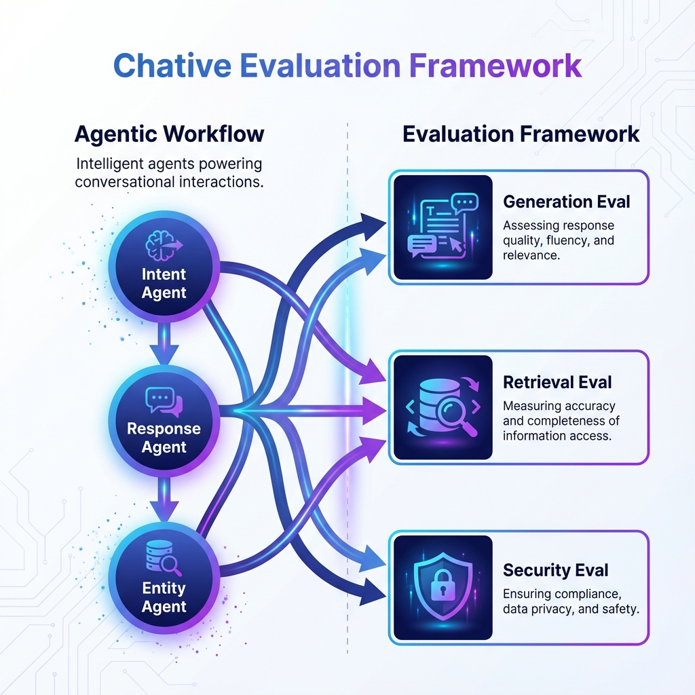

# Chative Evaluation



Evaluation framework for Chative agents using DeepEval.

# Agentic Workflow

The system adopts a modular **Agentic Workflow**, breaking down complex behaviors into specialized sub-agents. This modularity facilitates independent testing and optimization of each component:

- **Intent Agent**: Specialized in understanding user intent and routing queries (`src/agents/intent_agent`).
- **Response Agent**: Handles knowledge retrieval and tool execution to generate comprehensive responses (`src/agents/response_agent`).
- **Entity Agent**: Extracts specific entities from user input (if applicable).

# Evaluation Framework

To ensure the robustness and reliability of the agents, the evaluation is divided into three distinct parts:

## 1. Generation Evaluation (`eval_generation`)
Focuses on the quality of agent responses and classification accuracy.
- **Golden Generation**: Synthesizes diverse test cases to cover various user intents.
- **DeepEval Integration**: Measures metrics like intent accuracy and response relevance.

## 2. Retrieval Evaluation (`eval_retrieval`)
Focuses on the accuracy and relevance of the information retrieved by the agents.
- **Context Precision/Recall**: Measures how well the retrieved chunks match the user's query.
- **RAG Evaluation**: Ensures the retrieved context is sufficient for generating correct answers.

## 3. Security Evaluation (`eval_security`)
Focuses on the safety and robustness of the agents against adversarial attacks.
- **Red Teaming**: Simulates attacks (e.g., prompt injection, jailbreaking) to identify vulnerabilities.
- **Safety Metrics**: Monitors for harmful or inappropriate content generation.

# Setup & Usage

## Setup

1. **Install dependencies:**
   ```bash
   uv sync
   ```

2. **Environment Variables:**
   Create `.env` with your API keys (e.g., `OPENAI_API_KEY`).

## Usage


### Run Evaluations
```bash
# Run Intent Agent Evaluation
uv run eval_generation/intent_agent/run_eval.py
```

### Run Interactive Agent
```bash
python scripts/script_intent_agent.py
```
